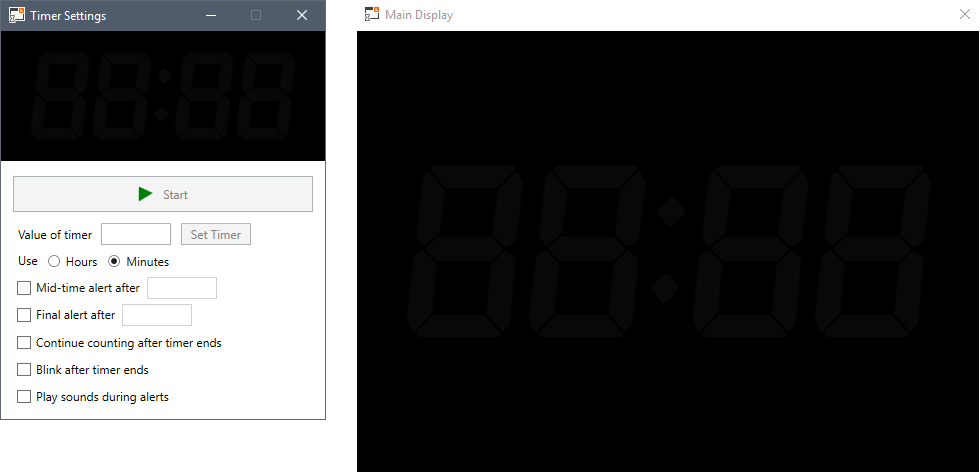
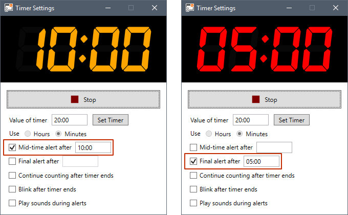

This is a simple application that can be used to provide a timer for events and presentations.

## Usage

The timer is divided in two screens: one is used to display the timer and the second is used to control the timer behaviour.

I recommend using this Timer application in a notebook connected to an external monitor set to extend the workspace area to this second monitor instead of mirroring. Place the **Main Display** window entirely on the external monitor and press F11 to make it full screen. Use the **Timer Settings** window to set the behaviour of the timer.

Application settings are very simple as can be seen from the interface. You can set whatever time you need for start and hit play to start counting down. By default timers will display in minutes (limited up to 99 minutes), set to use hours to extend this limit by using hours (limited up to 99 hours). If the value informed for the a timer is not valid, its box will change to a red border, hovering the cursor over it will display a message explaining what went wrong. Note that you cannot change from minutes to hours (and vice-versa) while the timer is running.

## Alerts

Options on the timer allow you to notify people present at the event with visual and auditive cues at a middle time (not actually bound to the middle of the start time), after when the timer will be shown in yellow, and a final time, after when the timer will be shown in red (colours cannot be changed). If the option is selected, the application will play a discrete sound at the given alert times.

## Other options

It is also possible to make the timer blink once it reaches zero and to continue counting after the timer expired. However, continuing the counting after zero makes it become upward thus it is recommended to either use blinking and/or final alert (it works even set to 00:00) to distinguish the expired time.
